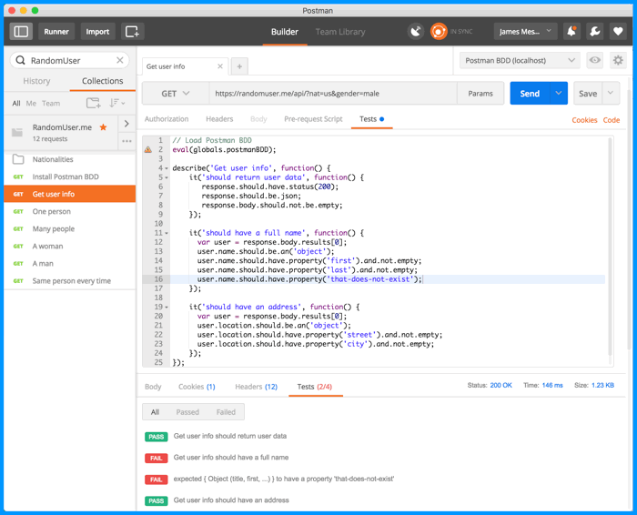
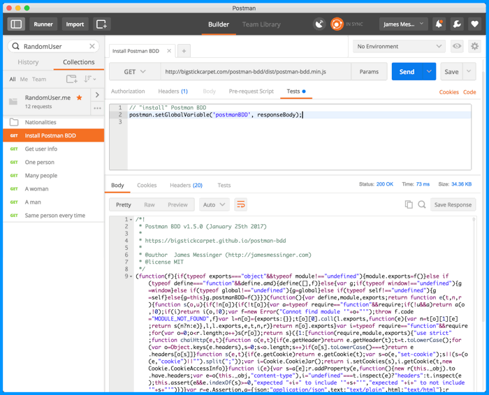

Postman BDD
============================
#### BDD test framework for Postman and Newman

[](https://travis-ci.org/BigstickCarpet/postman-bdd)
[](https://david-dm.org/BigstickCarpet/postman-bdd)
[](https://coveralls.io/r/BigstickCarpet/postman-bdd)
[](http://inch-ci.org/github/BigstickCarpet/postman-bdd)

[](https://www.npmjs.com/package/postman-bdd)
[](http://bower.io/)
[](LICENSE)


This project is a port of [Chai HTTP](https://github.com/chaijs/chai-http) that runs in the [Postman REST Client](http://getpostman.com).  The API is exactly the same, but instead of using `chai.request("http://my-server.com")`, you can use the Postman GUI to build and send your HTTP request.


Example
--------------------------



Installation
--------------------------
To install Postman BDD in Postman, just create a `GET` request to [`https://raw.githubusercontent.com/BigstickCarpet/postman-bdd/master/dist/postman-bdd.js`](dist/postman-bdd.js) or [`https://raw.githubusercontent.com/BigstickCarpet/postman-bdd/master/dist/postman-bdd.min.js`](dist/postman-bdd.min.js).  I recommend the unminified version, since it's easier to debug.

Go to the "Tests" tab of this request, and add the following script:

```javascript
// "install" Postman BDD
postman.setGlobalVariable('postmanBDD', responseBody);
```




Usage
--------------------------
You now have Postman BDD installed globally.  You can use it in any Postman request like this:

```javascript
// Load Postman BDD
eval(postman.getGlobalVariable('postmanBDD'));

describe('Get user info', function() {
    it('should return user data', function() {
       response.should.have.status(200);
       response.should.be.json;
       response.body.should.not.be.empty;
    });

    it('should have a full name', function() {
      var user = response.body.results[0].user;
      user.name.should.be.an('object');
      user.name.should.have.property('first').and.not.empty;
      user.name.should.have.property('last').and.not.empty;
      user.name.should.have.property('that-does-not-exist');
    });

    it('should have an address', function() {
      var user = response.body.results[0].user;
      user.location.should.be.an('object');
      user.location.should.have.property('street').and.not.empty;
      user.location.should.have.property('city').and.not.empty;
    });
});
```


Advanced Usage
--------------------------
Postman BDD supports more advanced features too.  I'll add documentation for them soon, but here's a little teaser :)

- **Simple debugging** - When a debugger is attached, Postman BDD will automatically pause when a test fails so you can debug it.

- **Nested `describe` blocks** - In standard BDD pattern, you can nest `describe` blocks to logically group your tests

- **Hooks** - Postman BDD supports all the standard BDD hooks: `before`, `after`, `beforeEach`, and `afterEach`, so you can reuse tests across multiple requests in your REST API.

- **JSON Schema Validation** - Postman BDD includes an assertion `response.body.should.have.schema(someJsonSchema)`, which allows you to validate your API's responses against a [JSON Schema](https://spacetelescope.github.io/understanding-json-schema/basics.html).  This is especially great if you've already built a [Swagger schema](http://editor.swagger.io) for your API.


API Documentation
--------------------------
The Postman BDD API is identical to [Chai HTTP's API](https://github.com/chaijs/chai-http#assertions), which is in-turn based on [SuperAgent's API](https://visionmedia.github.io/superagent/#response-properties).

### `response` object
The [`response` object](https://visionmedia.github.io/superagent/#response-properties) is what you'll be doing most of your assertions on.  It contains all the information about your HTTP response, such as [`response.text`](https://visionmedia.github.io/superagent/#response-text), [`response.body`](https://visionmedia.github.io/superagent/#response-body) (for JSON responses), [`response.status`](https://visionmedia.github.io/superagent/#response-status), and even a few shortcut properties like [`response.ok`](https://visionmedia.github.io/superagent/#response-status) and [`response.error`](https://visionmedia.github.io/superagent/#response-status).


### `expect` and `should` assertions
You can use any of the [Chai HTTP assertions](https://github.com/chaijs/chai-http#assertions) via Chai's [`expect` interface](http://chaijs.com/guide/styles/#expect) or [`should` interface](http://chaijs.com/guide/styles/#should).  It's just a matter of personal preference.  For example, the following two assertions are identical:

```javascript
// expect interface
expect(response).to.have.header('content-type', 'application/json');

// should interface
response.should.have.header('content-type', 'application/json');
```

Other assertsions you can do include `response.should.be.html`, `response.should.have.status(200)`, and `response.should.redirectTo("http://example.com")`


Contributing
--------------------------
I welcome any contributions, enhancements, and bug-fixes.  [File an issue](https://github.com/BigstickCarpet/postman-bdd/issues) on GitHub and [submit a pull request](https://github.com/BigstickCarpet/postman-bdd/pulls).

#### Building/Testing
To build/test the project locally on your computer:

1. __Clone this repo__<br>
`git clone https://github.com/bigstickcarpet/postman-bdd.git`

2. __Install dependencies__<br>
`npm install`

3. __Run the tests__<br>
`npm test`

4. __Start the local web server__<br>
`npm start` (then browse to [http://localhost:8080/](http://bigstickcarpet.com/postman-bdd/index.html)


License
--------------------------
Postman BDD is 100% free and open-source, under the [MIT license](LICENSE). Use it however you want.
I
